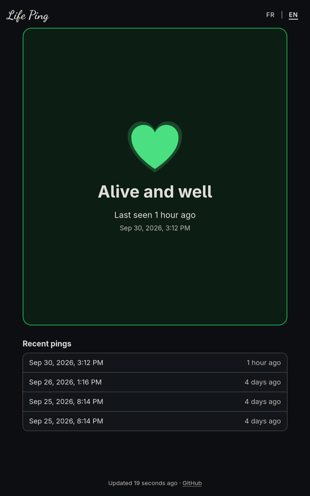

<div align="center">

# 💓 LifePing



A tiny self-hosted page that tells friends and family whether you're alive.

</div>

## Table of contents

- [What's the idea?](#whats-the-idea)
- [Deploy with Docker](#deploy-with-docker)
  - [Configuration](#configuration)
  - [Customising the text](#customising-the-text)
- [Sending pings](#sending-pings)
  - [From a computer (via bash script)](#from-a-computer-via-bash-script)
    - [Hyprland keybind example](#hyprland-keybind-example)
  - [From an Android phone (via HTTP Shortcuts app)](#from-an-android-phone-via-http-shortcuts-app)
- [LifePing API](#lifeping-api)
- [Development](#development)

## What's the idea?

Basically, every now and then, **YOU** send a `ping` *(really just an HTTP request)* to the LifePing server.
The server then stores the associated request timestamp in a simple text file.
Whenever someone visits the hosted web page, they can see how long ago the last ping was.
It also includes the times for the last 10 pings and that's it.

Depending on how much time has passed since the latest ping, it will display a different status message:

| Status  | Meaning                                         |
|---------|-------------------------------------------------|
| ⚫ grey    | no ping recorded yet                                     |
| 🟢 green   | last ping younger than `LIFEPING_YELLOW_AFTER`  |
| 🟡 amber   | older than that, but younger than `LIFEPING_RED_AFTER` |
| 🔴 red     | no sign of life for longer than `LIFEPING_RED_AFTER`   |

## Deploy with Docker

```sh
mkdir -p secrets
openssl rand -hex 32 > secrets/lifeping_token
```

Edit the lines marked `# CHANGE ME` in `compose.yaml` then run:

```sh
docker compose up --build -d
```

The container runs as the distroless `nonroot` user (UID/GID 65532). The
named volume in `compose.yaml` works as is. If you bind-mount a host directory
to `/data` instead, make it writable by that user:

```sh
sudo chown 65532:65532 ./data
```

Pings are stored in `/data/pings.log`, one UTC timestamp per line.

### Configuration

| Variable | Default | Description |
| --- | --- | --- |
| `LIFEPING_TOKEN` | – | Bearer token for `POST /api/ping` |
| `LIFEPING_TOKEN_FILE` | – | File containing the token (for Docker secrets). Set exactly one of the two token variables. |
| `LIFEPING_YELLOW_AFTER` | `12h` | Age after which the status turns amber (`90m`, `12h`, `1d 6h`, …) |
| `LIFEPING_RED_AFTER` | `24h` | Age after which the status turns red; must be greater than the amber threshold |
| `LIFEPING_HISTORY` | `10` | How many recent pings the page shows (1–1000) |
| `LIFEPING_DATA_DIR` | `/data` | Directory holding `pings.log` |
| `LIFEPING_BIND` | `0.0.0.0:8080` | Listen address |
| `LIFEPING_TITLE` | `Life Ping` | Site title shown in the header and browser tab (max 100 characters) |
| `LIFEPING_STRINGS_FILE` | – | JSON file overriding UI strings, see [Customising the text](#customising-the-text) |
| `RUST_LOG` | `lifeping=info` | Log filter |

### Customising the text

You can use a custom page title by setting `LIFEPING_TITLE`.

Every other piece of text on the page can be changed by pointing `LIFEPING_STRINGS_FILE` at a JSON file with the
same structure as [`web/strings.json`](web/strings.json).
You only need to list the strings you want to change; the rest keep their defaults:

```json
{
  "en": { "headline.green": "Still kicking!" },
  "fr": { "headline.green": "Toujours là !" }
}
```

`{hours}` and `{relative}` placeholders are dynamically replaced on page load with their real values.

If using custom text translations with Docker, you will need to make sure the file is mounted into the container, e.g. `./strings.json:/config/strings.json:ro`,
and set `LIFEPING_STRINGS_FILE: /config/strings.json`.

## Sending pings

Sending a ping is a simple as sending an HTTP POST request to the server:

```sh
curl --request POST --header "Authorization: Bearer $TOKEN" https://lifeping.example.com/api/ping
# {"timestamp":"2026-09-27T09:30:00Z"}
```

This makes it easy to implement a ping send in pretty much any device you own.

### From a computer (via bash script)

There is already a default bash script provided in `scripts/lifeping-ping`.
The script expects the `LIFEPING_URL` env var to be set and it will read the ping token from `~/.config/lifeping/token`. Feel free to adapt it to your specific needs.

When ran, it will attempt to send a single ping to the server and notify you via `notify-send`.

To easily install the script:

```sh
install -D --mode=755 scripts/lifeping-ping ~/.local/bin/lifeping-ping
install -D --mode=600 secrets/lifeping_token ~/.config/lifeping/token
```

#### Hyprland keybind example

Since I use Hyprland, I have configured a keybind in my `hyprland.lua` to make it easy to send a ping:

```lua
hl.bind(
 mainMod .. " + P",
 hl.dsp.exec_cmd("bash ~/.local/bin/lifeping-ping"),
 { description = "Send a ping to the LifePing server" }
)
```

### From an Android phone (via HTTP Shortcuts app)

There is an open-source Android app called [HTTP Shortcuts](https://http-shortcuts.rmy.ch/) that you can use to easily create shortcuts/widgets that trigger an HTTP request.

Once installed, you can configure the app to work with LifePing:

1. Create a new **Regular HTTP Shortcut**, named e.g. "I'm alive".
2. **Basic request settings**: method `POST`, URL
   `https://lifeping.example.com/api/ping`.
3. **Request headers**: add `Authorization` with value `Bearer <your token>`.
4. **Response handling**: show a toast on success and on failure.
5. Save, then long-press the shortcut → **Place on home screen**, or add an
   HTTP Shortcuts widget. One tap now sends a ping.

## LifePing API

| Endpoint | Auth | Description |
| --- | --- | --- |
| `GET /api/status` | none | Current status, latest ping, recent history, thresholds |
| `POST /api/ping` | `Bearer` | Records a ping at server time, returns `{"timestamp": …}` |
| `GET /healthz` | none | Returns `ok` |

To get latest pings:

```sh
curl https://{lifeping.example.com}/api/status
```

```json
{
  "now": "2026-09-27T09:30:00Z",
  "status": "green",
  "latest": "2026-09-27T07:58:02Z",
  "history": ["2026-09-27T07:58:02Z", "2026-09-26T19:03:10Z"],
  "total_pings": 2,
  "thresholds": { "yellow_after_secs": 43200, "red_after_secs": 86400 }
}
```

## Development

```sh
LIFEPING_TOKEN=dev LIFEPING_DATA_DIR=./data LIFEPING_BIND=127.0.0.1:8080 cargo run
cargo test
cargo clippy --all-targets -- --deny warnings
cargo fmt --check
```

To watch the colours change without waiting a day, start the server with
`LIFEPING_YELLOW_AFTER=1m LIFEPING_RED_AFTER=2m`.
